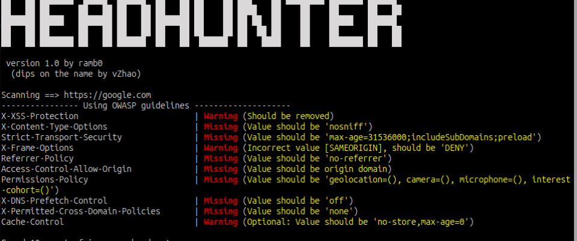

# OWASPHeadersCheck
Script that scans the security headers based on OWASP secure headers project and NOREA's (DigiD) guidelines.



## How to run
```sh
# For scanning a single URL
$ python3 owaspHeaderCheck.py URL

# For scanning an input file with URLs line by line
$ python3 owaspHeaderCheck.py -f FILE

# For only warning output
$ python3 owaspHeaderCheck.py -s URL 
# For scanning URLs based on NOREA guidelines

$ python3 owaspHeaderCheck.py -d URL
```
## Usage
```
usage: ./owaspHeaderCheck.py [options] URL

positional arguments:
  URL                   The URL to scan or input file to use (when -f is specified)

options:
  -h, --help            show this help message and exit
  -f, --file            Use input file with targets. (URL is input file)
  -d, --use-digid       Use the DigiD guidelines; default: OWASP guidelines.
  -H HEADERSTOUSE, --headers HEADERSTOUSE
                        Headers to use (not working yet)
  -a CREDENTIALS, --auth CREDENTIALS
                        Authentication credentials
  -c COOKIES, --cookie COOKIES
                        Cookies to use
  -s, --silent          Silent mode, print only if it goes wrong
  -p {POST,GET,HEAD,OPTIONS,PUT,DELETE}, --post {POST,GET,HEAD,OPTIONS,PUT,DELETE}
                        Specify the request

The script follows the OWASP or NOREA guidelines for HTTP security headers.
```

## Resources
https://owasp.org/www-project-secure-headers/
```
To add:
https://owasp.org/www-project-secure-headers/ci/headers_add.json

To remove: 
https://owasp.org/www-project-secure-headers/ci/headers_remove.json
```
